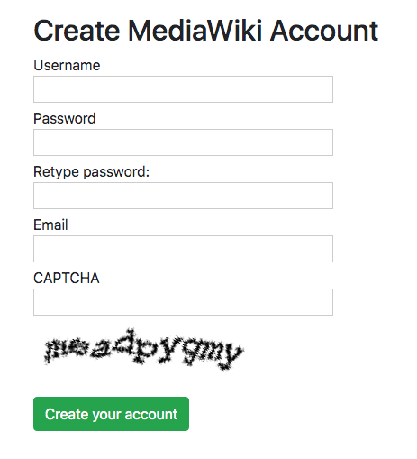

# Account creator
Demo of creating an account on a wiki with a special authentication extension installed. This app considers a case of a wiki where captcha is enabled through extensions like [ConfirmEdit](https://www.mediawiki.org/wiki/Extension:ConfirmEdit). [Browse the app here](https://tools.wmflabs.org/account-creator/).


Install
-------

```
$ git clone https://github.com/wikimedia/mediawiki-api-demos
$ cd mediawiki-api-demos/apps/account-creator
$ pip install -r requirements.txt
Install the necessary python modules with pip
$ python3 app.py
```

Screenshots
-----------
<table><tr><td>

</td></tr></table>