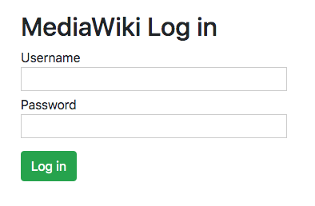

# Client login
Demo of logging-in on a wiki

Install
-------

```
$ git clone https://github.com/wikimedia/mediawiki-api-demos
$ cd mediawiki-api-demos/apps/client-login
$ pip install flask
Install the necessary python modules with pip
$ python3 clientlogin.py
```

Screenshots
-----------
<table><tr><td>

</td></tr></table>