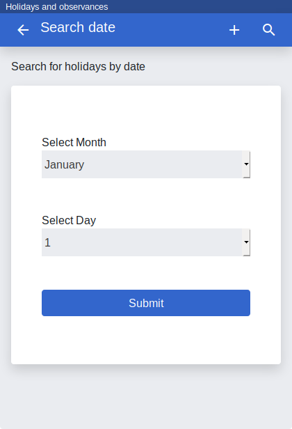
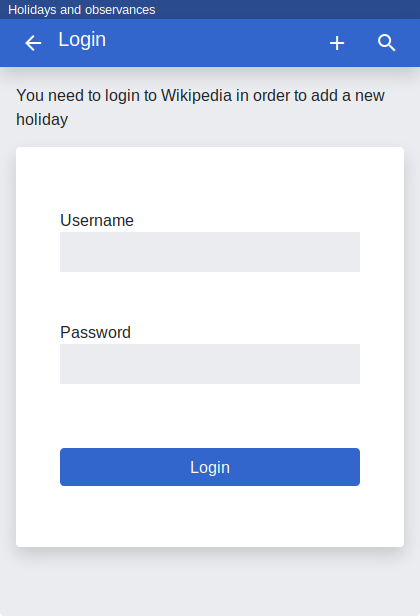
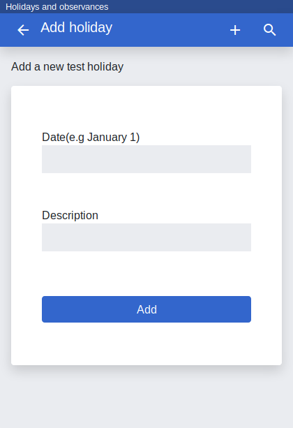

# Holidays-Viewer
A demo app that fetches the day's holidays from Wikipedia with options to search for holidays of other dates, and logging in to add new holidays. The app uses [API:Parse](https://www.mediawiki.org/wiki/API:Parse) to fetch the holidays, [API:Login](https://www.mediawiki.org/wiki/API:Login) to authenticate a user and [API:Edit](https://www.mediawiki.org/wiki/API:Edit) to add a new holiday. [Browse the app here](https://tools.wmflabs.org/holidays-viewer/).

Install
-------

```
$ git clone https://github.com/wikimedia/mediawiki-api-demos
$ cd mediawiki-api-demos/apps/holidays-viewer
$ pip install -r requirements.txt
Install the necessary python modules with pip
$ python3 app.py
```

Screenshot
----------
<table>
  <tr>
    <td>
    <td>
    <td>
    <td>
  <tr>
    <td>1. List holidays
    <td>2. Search holidays
    <td>3. Login
    <td>4. Add a holiday
</table>
