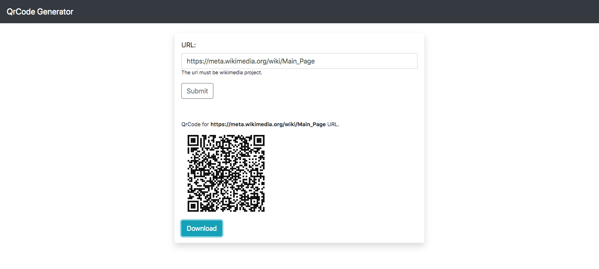

# QR Code Generator
This is a qrcode generator for Wikimedia Site. This app also demonstrate the usage of MediaWiki API with [OAuth](https://www.mediawiki.org/wiki/Help:OAuth).

Install
-------

```
$ git clone https://github.com/Jayprakash-SE/qrcode-generator.git
$ pip install -r requirements.txt
$ python3 app.py
```

Screenshot
----------

<table><tr><td>

</td></tr></table>

Todo
----------
* Integrate with OAuth
* Demonstrate the use of API:Upload with OAuth
* Add Filter to restrict it for only Wikimedia Sites