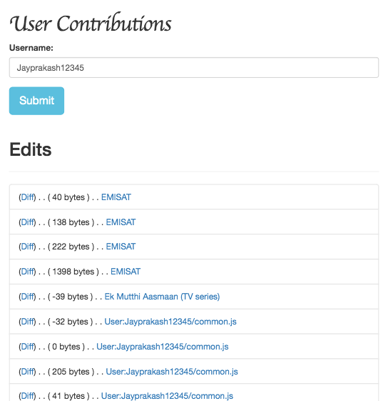

# User Contributions Feed
Demp app that uses [list=usercontribs](https://www.mediawiki.org/wiki/API:Usercontribs) module to fetch the top 50 edits made by a user.

Install
-------

```
$ git clone https://github.com/wikimedia/mediawiki-api-demos.git
$ cd mediawiki-api-demos/apps/user-contributions-feed
$ pip install flask requests
$ python3 app.py
```

Screenshot
----------

<table><tr><td>

</td></tr></table>
