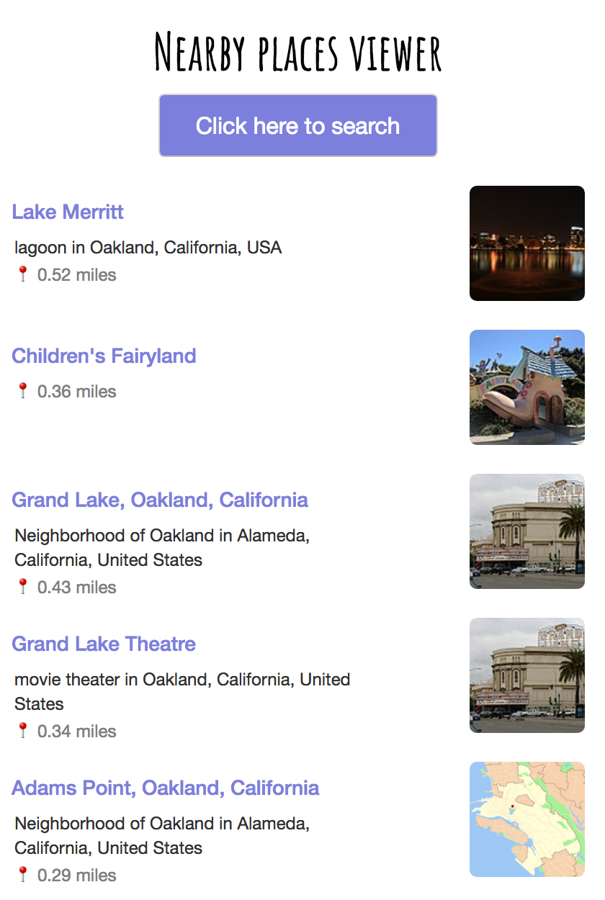

# Nearby Places Viewer

Geo search for wiki pages near your location using the [Geolocation API](https://developer.mozilla.org/en-US/docs/Web/API/Geolocation_API) and MediaWiki Action API's [Geosearch](https://www.mediawiki.org/wiki/API:Geosearch) module. 

Install
-------
```
$ git clone https://github.com/srish/MediaWiki_Action_API_Code_Samples
$ cd MediaWiki-Action-API-Code-Samples/python/demos/article suggestion
Install the necessary python modules with pip
$ python3 nearby.py
```

Screenshot
----------
<table><tr><td>

</td></tr></table>

Credits
-------
[Nearby](https://github.com/prtksxna/pebble-nearby), a Pebble app.
